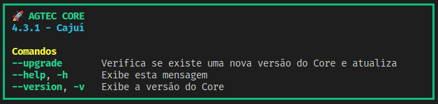
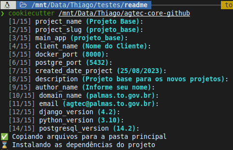

*Esta ferramenta digital faz parte do catálogo de ferramentas do **Banco Interamericano de Desenvolvimento**. Você pode saber mais sobre a iniciativa do BID em [code.iadb.org](https://code.iadb.org)*

<h1 align="center"> Agtec Core</h1>
<p align="center"></p>

## Tabela de conteúdos:
---

- [Tabela de conteúdos:](#tabela-de-conteúdos)
- [Informações](#informações)
- [Descrição e contexto](#descrição-e-contexto)
- [Documentação](#documentação)
- [Documentação Externa](#documentação-externa)
- [Guia de instalação](#guia-de-instalação)
- [Dependências](#dependências)
- [Como contribuir](#como-contribuir)
- [Estrutura do projeto gerado](#estrutura-do-projeto-gerado)
- [Autor(es)](#autores)
  - [Coordenador](#coordenador)
    - [Guilherme de Carvalho Carneiro](#guilherme-de-carvalho-carneiro)
  - [Desenvolvedores](#desenvolvedores)
    - [Thiago Schuch](#thiago-schuch)
    - [Claysllan Ferreira](#claysllan-ferreira)
    - [Brayan Mota](#brayan-mota)
    - [Lucas Siqueira](#lucas-siqueira)
    - [Robson Ronzani](#robson-ronzani)
    - [Emanoel Mendes](#emanoel-mendes)
    - [Thales Barbosa](#thales-barbosa)
    - [Márcio Henrique Rodrigues de Lima](#márcio-henrique-rodrigues-de-lima)
    - [Clazzeani Almeida](#clazzeani-almeida)
    - [André Praça de Almeida Pinheiro](#andré-praça-de-almeida-pinheiro)
    - [Marco Antônio Martins Porto Netto](#marco-antônio-martins-porto-netto)
- [Licença](#licença)

## Informações
---
- Dependências de Terceiros: 
- [](https://sonarcloud.io/summary/new_code?id=agtecPalmas_agtecCore)

  
  
  

## Descrição e contexto
---
Esse projeto foi desenvolvimento para facilitar o desenvolvimento de sistemas Django trazendo diversas tecnologias embarcadas para expandir o conceito Don't Repeat Yourself (DRY). Além das tecnologias já embarcadas, temos managers para automatizar a geração de código do projeto.

## Documentação
___

Utilizamos no desenvolvimento da ferramenta o pacote [mkdocs](https://www.mkdocs.org/), para gerar a documentação do projeto, acesse o site do mkdocs para maiores informações.

## Documentação Externa
---
Acesse a documentação contendo todos os detalhes do projeto em: 
<https://agtecpalmas.github.io/AgtecCore/>

 
## Guia de instalação
---

- Clone este projeto
```
git clone https://github.com/agtec/
```

- Crie um diretório para o seu projeto fora do Clone
```
mkdir <nome_do_seu_projeto>
```

- Acesse o diretório criado na etapa anterior

```
  cd <nome_do_seu_projeto>
```

- Crie e ative um ambiente virtual python (Exemplo)
```
  python3 -m venv venv
  source venv/bin/activate
```

- Atualize o PIP (Recomendado)
````
  python3 -m pip install --upgrade pip
````

- Instale o **cookiecutter**
````console
  pip install cookiecutter==2.3.0
````

- Inicie o projeto com o Cookiecutter apontando para o Clone do Agtec Core
```
cookiecutter <caminho_para_o_clone>/AgtecCore
```

- Siga os passos informados no terminal
  
  

- Configure seu arquivo .env com as informações do seu banco de dados

- Execute as migrações
```
python3 manage.py makemigrations
python3 manage.py migrate
```

- Crie um super usuário
```
python3 mock_superuser.py
```

- Execute o projeto
```
python3 manage.py runserver
```

---

- Caso o processo do Cookiecutter não tenha sido concluído corretamente, execute os comandos abaixo para instalar as dependências do projeto
```
python3 -m pip install -r requirements.txt
python3 -m pip install -r requirements-dev.txt
```

- Construa as aplicações iniciais
```
python3 manage.py build usuario --all
python3 manage.py build configuracao_core --all
```

## Dependências
---
Principais dependências do projeto:

    # Produção
    Django
    Django Rest Framework
    PsyCopg
    Sentry
    ...

    # Desenvolvimento
    Black
    Djlint
    Mkdocs
    Pytest
    Rich
    Taskipy
    ...


## Como contribuir
---
Há várias formas de contribuir com o projeto, com código, testes, documentação, etc.
Acesse a documentação externa na seção [Documentação Externa](#documentação-externa) para saber mais sobre como contribuir com o projeto.


## Estrutura do projeto gerado
---


## Autor(es)
---
### Coordenador

#### Guilherme de Carvalho Carneiro

[](https://twitter.com/GCarneiro)
[](https://github.com/guilhermecarvalhocarneiro)
[](https://www.linkedin.com/in/guilhermecarvalho/)

### Desenvolvedores

#### Thiago Schuch

[](https://t.me/thigschuch)
[](https://github.com/thigschuch)
[](https://linkedin.com/in/thiago-schuch)

#### Claysllan Ferreira

[](https://www.twitter.com/claysllanxavier/)
[](https://github.com/claysllanxavier)
[](https://www.linkedin.com/in/claysllanxavier/)

#### Brayan Mota

[](https://twitter.com/brayan_ncm)
[](https://github.com/BrayanMota)
[](https://linkedin.com/in/brayan-mota)
[](https://www.instagram.com/brayanmotaa/)

#### Lucas Siqueira

[](https://github.com/lucas-siqueira)

#### Robson Ronzani

[](https://github.com/ronzani)
[](https://www.linkedin.com/in/robson-ronzani/)

#### Emanoel Mendes

[](https://github.com/emanoelmendes2)
[](https://www.linkedin.com/in/emanoel-mendes/)
[](https://www.instagram.com/emmmagalhaes/)

#### Thales Barbosa

[](https://github.com/tbblack)
[](https://www.linkedin.com/in/thales-barbosa-de-oliveira/)

#### Márcio Henrique Rodrigues de Lima

[](https://github.com/marciohr9)
[](https://www.linkedin.com/in/m%C3%A1rcio-henrique-rodrigues-de-lima-71b08576/)

#### Clazzeani Almeida

[](https://github.com/clazzeani)
[](https://www.linkedin.com/in/clazzeani-almeida-a8a9bb42/)

#### André Praça de Almeida Pinheiro

[](https://github.com/apracapinheiro)
[](https://www.linkedin.com/in/andr%C3%A9-pinheiro-03064120/)

#### Marco Antônio Martins Porto Netto

[](https://github.com/Tchez)
[](https://www.linkedin.com/in/tch%C3%AA/)


## Licença
---

The MIT License (MIT)

Copyright © 2023 Agtec

Permission is hereby granted, free of charge, to any person obtaining a copy of this software and associated documentation files (the “Software”), to deal in the Software without restriction, including without limitation the rights to use, copy, modify, merge, publish, distribute, sublicense, and/or sell copies of the Software, and to permit persons to whom the Software is furnished to do so, subject to the following conditions:

The above copyright notice and this permission notice shall be included in all copies or substantial portions of the Software.

THE SOFTWARE IS PROVIDED “AS IS”, WITHOUT WARRANTY OF ANY KIND, EXPRESS OR IMPLIED, INCLUDING BUT NOT LIMITED TO THE WARRANTIES OF MERCHANTABILITY, FITNESS FOR A PARTICULAR PURPOSE AND NONINFRINGEMENT. IN NO EVENT SHALL THE AUTHORS OR COPYRIGHT HOLDERS BE LIABLE FOR ANY CLAIM, DAMAGES OR OTHER LIABILITY, WHETHER IN AN ACTION OF CONTRACT, TORT OR OTHERWISE, ARISING FROM, OUT OF OR IN CONNECTION WITH THE SOFTWARE OR THE USE OR OTHER DEALINGS IN THE SOFTWARE.

-----------------

[](https://github.com/ellerbrock/open-source-badges/)
[](https://www.python.org/)
[](https://code.visualstudio.com/)
