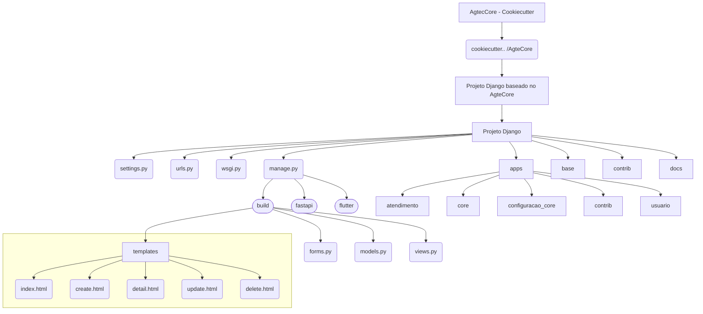

# Projeto AgtecCore

## Documentação

https://agtecpalmas.github.io/AgtecCore/

## Pré requisitos

Faça o clone desse projeto para o diretório

Crie um diretório para o seu projeto

```console
mkdir "nome_do_seu_projeto"
```

Acesse o diretório criado na etapa anterior

```console
cd "nome_do_seu_projeto" 
```

Crie e ative um ambiente virtual python

```console
python3 -m venv venv
```

Atualize o pip

```console
python3 -m pip install --upgrade pip
```

Instale o **cookiecutter**

```console
pip install cookiecutter==2.1.1
```

Instale o gerenciador de pacote **pip-tools**

```console
pip install pip-tools
```

## Uso

Rode o cookiecutter apontando para o diretório do projeto agtecore:

```console
cookiecutter ../DIRETORIO_AONDE_FOI_CLONADO_O_PROJETO
```

Responda as perguntas sobre seu novo projeto:

    project_name [Base]: Informe o nome do projeto 
    project_slug [base]: Apenas clique enter
    main_app [base]: Apenas clique enter 
    client_name [Nome do Cliente]: Informe o nome da secretaria/setor que solicitou a demanda
    docker_port [8000]: Informe a porta que será utilizada para o projeto
    postgre_port [5432]: Informe a porta que será utilizada para o banco de dados
    created_date_project: Apenas clique enter 
    description [Projeto base para os novos projetos]: Escolha uma definição para seu projeto
    author_name [Informe seu nome]: Digite seu nome completo, caso contrário o autor do projeto será Agtec
    domain_name [palmas.to.gov.br]: Digite o domínio do seu orgão ou empresa 
    email [agtec@palmas.to.gov.br]: Digite o email do seu orgão ou empresa

Gere as dependências do projeto ***Caso tenha realizado alguma alteração nos arquivos de requirements***

```console
pip-compile requirements.in
pip-compile requirements-dev.in
```

Instale as dependências do projeto

```console
pip install -r requirements.txt 
pip install -r requirements-dev.txt (ambiente de debug/homologação)
```

-----------------

## Documentação

Utilizamos no desenvolvimento da ferramenta o pacote [mkdocs](https://www.mkdocs.org/), para gerar a documentação do projeto, acesse o site do mkdocs para maiores informações.

-----------------

## Estrutura do projeto gerado



## Licença

[MIT](https://mit-license.org/)

-----------------

[](https://github.com/ellerbrock/open-source-badges/)
[](https://www.python.org/)
[](https://code.visualstudio.com/)
