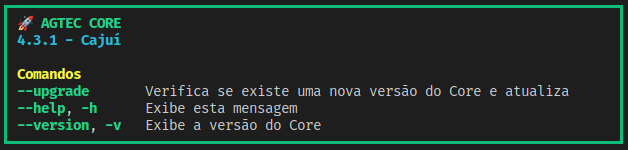
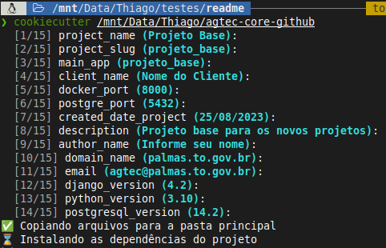

*Esta ferramenta digital faz parte do catálogo de ferramentas do **Banco Interamericano de Desenvolvimento**. Você pode saber mais sobre a iniciativa do BID em [code.iadb.org](https://code.iadb.org)*

<h1 align="center"> Agtec Core</h1>
<p align="center"></p>


## Tabela de conteúdos

- [Tabela de conteúdos](#tabela-de-conteúdos)
- [Descrição e contexto](#descrição-e-contexto)
- [Gerando um novo projeto](#gerando-um-novo-projeto)
  - [Opção 1 — generate\_project.py (recomendado)](#opção-1--generate_projectpy-recomendado)
  - [Opção 2 — CookieCutter (legado)](#opção-2--cookiecutter-legado)
- [Executando o projeto com o UV (Astral)](#executando-o-projeto-com-o-uv-astral)
- [Taskpy](#taskpy)
- [Dependências](#dependências)
- [Desenvolvimento assistido por IA](#desenvolvimento-assistido-por-ia)
  - [Configuração do ambiente](#configuração-do-ambiente)
  - [Como escrever prompts eficazes](#como-escrever-prompts-eficazes)
- [Licença](#licença)

## Descrição e contexto

---
Esse projeto foi desenvolvimento para facilitar o desenvolvimento de sistemas Django trazendo diversas tecnologias embarcadas para expandir o conceito Don't Repeat Yourself (DRY). Além das tecnologias já embarcadas, temos managers para automatizar a geração de código do projeto.

---

- Clone este projeto

```
  git clone git@git.palmas.to.gov.br:dti-desenvolvimento/agteccore.git
```


## Gerando um novo projeto

### Opção 1 — generate\_project.py (recomendado)

O script `generate_project.py` substitui o CookieCutter e não requer dependência externa além do ambiente virtual do AgtecCore.

**Pré-requisitos:** clone do AgtecCore com `uv` disponível no PATH.

```bash
# 1. Clone o AgtecCore e ative o ambiente virtual
git clone https://git.palmas.to.gov.br/dti-desenvolvimento/agteccore
cd AgtecCore
uv sync
source .venv/bin/activate   # Linux/macOS
# ou: .venv\Scripts\activate  (Windows)

# 2. Execute o gerador (modo interativo)
python generate_project.py

# 3. O projeto será criado em ../nome_do_projeto/
```

**Passando argumentos diretamente (modo não-interativo):**

```bash
python generate_project.py \
  --project-name "Meu Sistema" \
  --client-name "Prefeitura" \
  --author-name "Dev" \
  --domain-name "palmas.to.gov.br" \
  --email "dev@palmas.to.gov.br" \
  --docker-port 8080 \
  --no-git \
  --no-install
```

**Flags opcionais:**

| Flag | Efeito |
|---|---|
| `--no-install` | Não executa `uv sync` |
| `--no-git` | Não inicializa repositório git |
| `--no-build-apps` | Não executa `manage.py build` para apps padrão |

> O projeto é sempre criado no mesmo nível que o AgtecCore. O destino não pode ser alterado.

**Após a geração:**

```bash
cd ../nome_do_projeto
# Ajuste o .env com as credenciais do banco de dados
python manage.py makemigrations
python manage.py migrate
python mock_superuser.py
python manage.py runserver
```

---

### Opção 2 — CookieCutter (legado)

O CookieCutter permanece disponível para compatibilidade. Veja a seção abaixo.

---

## Executando o projeto com o UV (Astral)

O UV é um gerenciador de projetos Python que engloba várias funcionalidades, como:

1. Instalar versões do Python.
2. Criar ambientes virtuais.
3. Instalar dependências do projeto.
4. Executar o projeto.

Para executar o projeto com o UV, siga os passos abaixo:

1. Instale o UV, caso ainda não tenha instalado, https://docs.astral.sh/uv/getting-started/installation/

- macOS e Linux
```
  curl -LsSf https://astral.sh/uv/install.sh | sh
```
- Windows
```
  powershell -ExecutionPolicy ByPass -c "irm https://astral.sh/uv/install.ps1 | iex"
```

- Adicione no path para reconhecer o comando
 

- Crie um diretório para o seu projeto fora do Clone do AgtecCore
```
  mkdir <nome_do_seu_projeto>
```

- Dentro do AgtecCore, crie o venv usando uv e apontando para o diretorio criado
``` 
  uv venv  <caminho_diretorio_do_projeto>\.venv
```

- Ative o virtual ambiente do venv criado ainda na pasta AgtecCore
```
  .\<caminho_diretorio_do_projeto>\.venv\Scripts\activate
```

- Instale as libs no venv:
```
  uv sync --all-groups --active
```

- Acesse o diretório criado na etapa anterior

```
  cd <nome_do_seu_projeto>
```
 
- Inicie o projeto com o Cookiecutter apontando para o Clone do Agtec Core

```
  cookiecutter <caminho_para_o_clone>/AgtecCore
```

- Siga os passos informados no terminal
  
  


- Nesse momento pode continuar por aqui, porem caso queira é mais pratico abrir o projeto criado. 


- Ative o venv do projeto
```
  .venv\Scripts\activate
```
- Atualize o venv
```
  uv sync --all-groups --active
```
---

- Configure seu arquivo .env com as informações do seu banco de dados

---

- Execute as migrações

```
  python manage.py makemigrations
```
```
  python manage.py migrate
```

- Crie um super usuário

```
  python mock_superuser.py
```

- Execute o projeto

```
  python manage.py runserver
```

---

- Caso o processo do Cookiecutter não tenha sido concluído corretamente, execute os comandos abaixo para instalar as dependências do projeto

- Ative o venv
```
  .venv\Scripts\activate
```
- Atualize o venv
```
  uv sync --all-groups --active
```

- Construa as aplicações iniciais

```
  python manage.py build usuario --all
```
```
  python manage.py build configuracao_core --all
```

## Taskpy

Como forma de facilitar o uso de comandos comuns no desenvolvimento do projeto, utilizamos o [Taskipy](https://taskipy.org/) para gerenciar esses comandos.
Após a instalação das dependências do projeto, você poderá utilizar os seguintes comandos via Taskipy:

```bash
build-all              python manage.py build --all
build-fastapi          python manage.py fastapi
build-force            python manage.py build --all --force
core-upgrade           python manage.py core --upgrade
core-version           python manage.py core --version
coverage               coverage html
docs                   mkdocs serve
lint                   black --diff --color . && isort --check-only --diff .
mgt                    python manage.py migrate
mkm                    python manage.py makemigrations
post-test              coverage html
pre-test               task lint
run                    python manage.py runserver
runserver              python manage.py runserver
shell                  python manage.py shell
startapp               python manage.py startapp
test                   pytest -s -x --cov=federacao_bt -vv
```

Exemplo de uso:

```
task build-all NOME_DA_APP
```

Consultado o help para saber quais parâmetros podem ser passados:

```
task build-all --help
```

## Dependências

---
Principais dependências do projeto:

    # Produção
    Django
    Django Rest Framework
    PsyCopg
    Sentry
    ...

    # Desenvolvimento
    Black
    Djlint
    Mkdocs
    Pytest
    Rich
    Taskipy
    ...

## Desenvolvimento assistido por IA

---

Todo projeto gerado pelo AgtecCore inclui um pacote de governança de IA em `.ia/` com skills, documentação arquitetural, templates de tasks/specs e scripts de automação. O arquivo `AGENTS.md` na raiz do projeto gerado é o ponto de entrada para os agentes.

Consulte `.ia/README.md` no projeto gerado para o guia completo. Esta seção cobre a configuração inicial e o uso básico.

---

### Configuração do ambiente

Execute os passos abaixo **uma vez por máquina** após gerar o projeto com o Cookiecutter.

**1. Instalar o OpenCode**

OpenCode é o ambiente de terminal com IA que orquestra os agentes neste projeto.

```bash
# macOS / Linux (recomendado)
curl -fsSL https://opencode.ai/install | bash

# Homebrew
brew install anomalyco/tap/opencode

# npm
npm install -g opencode-ai
```

Inicialize na raiz do projeto gerado:

```bash
cd /caminho/do/projeto
opencode
```

Execute `/init` para que o agente registre o `AGENTS.md` como contexto ativo.

> Documentação: https://opencode.ai/docs

---

**2. Instalar o RTK**

RTK intercepta comandos shell e reduz 60–90% do consumo de tokens em operações de dev.

```bash
# Homebrew
brew install rtk

# Linux / macOS
curl -fsSL https://raw.githubusercontent.com/rtk-ai/rtk/refs/heads/master/install.sh | sh
```

```bash
rtk init -g --opencode   # integra ao OpenCode
rtk gain                 # verifica economia acumulada
```

> Repositório: https://github.com/rtk-ai/rtk

---

**3. Instalar o Caveman**

Comprime as respostas dos agentes em ~75% sem perda de precisão técnica.

```bash
curl -fsSL https://raw.githubusercontent.com/JuliusBrussee/caveman/main/install.sh | bash
```

> Repositório: https://github.com/JuliusBrussee/caveman

---

**4. Configurar o Obsidian Brain (memória persistente)**

```bash
# Criar vault no Obsidian e configurar a variável no projeto
OBSIDIAN_DEV_VAULT="CAMINHO_PARA_SEU_VAULT/DevBrain"
```

Use as skills `obsidian-sync` e `obsidian-query` para exportar e consultar contexto do repositório.

---

**5. Onboarding inicial do projeto gerado**

```
Execute a skill django-onboarding-checklist para validar o projeto gerado.
```

O agente verificará `INSTALLED_APPS`, `AUTH_USER_MODEL`, migrations e variáveis de ambiente antes de qualquer demanda.

---

### Como escrever prompts eficazes

A qualidade do resultado do agente é proporcional à qualidade do prompt.

**Prompt ruim — o que evitar:**

```
Faça um módulo de login com o govBR
```

Sem contexto de origem, sem referência à arquitetura, sem escopo — o agente cria código genérico, ignora o padrão do projeto e vai direto para implementação sem task.

---

**Prompt correto — o que fazer:**

```
Recebemos da equipe de produto a demanda de implementar login integrado com o SSO
govBR. Leia a documentação oficial em https://login.gov.br/documentacao para
entender o fluxo OAuth2/OIDC e siga as regras de AGENTS.md.

Crie o planejamento com as camadas impactadas (models, serializers, views, testes),
os critérios de aceite e as skills a usar. Não implemente até a aprovação.
```

---

**Anatomia de um prompt bem escrito:**

```
[ORIGEM]    De onde veio a demanda (produto, cliente, bug, débito técnico).
[OBJETIVO]  O que precisa ser verdade ao final — comportamento, não código.
[REFERÊNCIAS] Documentação externa (URLs) + arquivos internos (.ia/docs/*, AGENTS.md).
[RESTRIÇÕES]  Camadas que não devem ser tocadas, prazo, LGPD.
[FLUXO]     "Crie o planejamento e aguarde aprovação antes de implementar."
```

---

**Exemplos adicionais:**

| Ruim | Correto |
|---|---|
| `Adiciona paginação nas listagens` | Descreva o problema (timeout em produção no app X), cite o padrão em `AGENTS.md`, peça planejamento antes de implementar |
| `Refatora o app XPTO` | Aponte os arquivos com N+1 identificados, cite a restrição correspondente em `constraints.md`, peça task com escopo delimitado |

> Regra geral: o agente executa melhor quando recebe **contexto**, **restrições** e **ordem de operações** — não apenas *o que fazer*. Consulte `.ia/README.md` no projeto gerado para o guia completo com exemplos detalhados.

## Licença

---

The MIT License (MIT)

Copyright © 2026 Agtec

Permission is hereby granted, free of charge, to any person obtaining a copy of this software and associated documentation files (the “Software”), to deal in the Software without restriction, including without limitation the rights to use, copy, modify, merge, publish, distribute, sublicense, and/or sell copies of the Software, and to permit persons to whom the Software is furnished to do so, subject to the following conditions:

The above copyright notice and this permission notice shall be included in all copies or substantial portions of the Software.

THE SOFTWARE IS PROVIDED “AS IS”, WITHOUT WARRANTY OF ANY KIND, EXPRESS OR IMPLIED, INCLUDING BUT NOT LIMITED TO THE WARRANTIES OF MERCHANTABILITY, FITNESS FOR A PARTICULAR PURPOSE AND NONINFRINGEMENT. IN NO EVENT SHALL THE AUTHORS OR COPYRIGHT HOLDERS BE LIABLE FOR ANY CLAIM, DAMAGES OR OTHER LIABILITY, WHETHER IN AN ACTION OF CONTRACT, TORT OR OTHERWISE, ARISING FROM, OUT OF OR IN CONNECTION WITH THE SOFTWARE OR THE USE OR OTHER DEALINGS IN THE SOFTWARE.

-----------------

[](https://github.com/ellerbrock/open-source-badges/)
[](https://www.python.org/)
