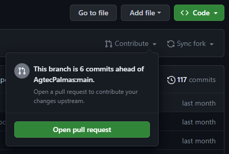

# Primeiros Passos

Obrigado por se interessar em contribuir no nosso projeto! Nesse documento há instruções básicas de como fazer isso.

## Faça um fork da branch `desenvolvimento`

Para contribuir com o projeto, você deve fazer um fork da branch `desenvolvimento` do projeto. Para isso, na [página do projeto](https://github.com/nuvols//tree/desenvolvimento), basta clicar no botão `Fork` no canto superior direito da tela.
> Certifique-se de estar usando o fork da branch `desenvolvimento` e não da `main`.

## Clone o fork para sua máquina local

Você deve clonar o fork para sua máquina local. Para isso, basta copiar o link do seu fork e executar o comando `git clone <link_do_fork>`.

## Inicie um projeto com o AgtecCore

Inicialmente, você deve fazer as alterações em um projeto gerado com o AgtecCore e, assim que finalizar, verifique o resultado das alterações. Se estiver tudo certo, transcreva as alterações para o seu fork. Esse processo é necessário pois, para ver o resultado das alterações, você deve rodar a documentação do projeto localmente e isso só é possível se você tiver um projeto gerado com o AgtecCore. Para iniciar um projeto com o AgtecCore, siga o passo a passo do [readme](https://github.com/nuvols//#readme) do projeto.
> Sugerimos esse processo pois, caso você faça as alterações diretamente no seu fork, não será tão simples de ver o resultado das alterações em tempo real. 

## Faça suas alterações

Faça as alterações que deseja no projeto iniciado com o AgtecCore.

## Use outra branch para suas alterações

Para manter o projeto organizado e facilitar a revisão das suas alterações, você deve criar uma branch para suas alterações. Para isso, basta executar o comando `git checkout -b <nome_da_branch>`.

## Transcreva as alterações para seu fork

Após finalizar suas alterações do projeto iniciado com o Agtec Core, você deve transcrever elas para o seu fork.

## Commit suas alterações

Após realizar suas alterações, você deve fazer o commit delas. Para isso, basta executar o comando `git commit -m "<mensagem_do_commit>"`.
> Lembre-se de seguir as boas práticas de commit, indicamos o uso dos [Conventional Commits](https://www.conventionalcommits.org/en/v1.0.0/).

## Faça um push das suas alterações

Após realizar o commit das suas alterações, você deve fazer um push delas. Para isso, basta executar o comando `git push origin <nome_do_branch>`.

## Atualize seu fork fazendo um git pull

Antes de abrir um Pull Request, você precisa garantir que seu fork está atualizado com a branch `desenvolvimento` do projeto AgtecCore, pois neste meio tempo pode ter ocorrido alguma alteração nessa branch, gerando conflitos com suas alterações. Para que isso não ocorra, basta atualizar seu fork executando o comando `git pull upstream desenvolvimento`.

## Abra uma Pull Request (PR)

Após adicionar as alterações no seu fork e atualizar a branch, você deve abrir um Pull Request para a branch `desenvolvimento` do projeto AgtecCore. Para isso, basta clicar no botão `Compare & pull request` ou `Open pull request` no seu fork.
> Lembre-se de confirmar se a PR está sendo aberta da branch `desenvolvimento` do seu fork para a branch `desenvolvimento` do projeto AgtecCore.

> Lembre-se também de fazer a pull para atualizar seu fork antes de abrir a PR.

## Aguarde a revisão da sua PR

Após abrir a Pull Request, você deve aguardar a revisão da mesma. Caso seja necessário realizar alguma alteração, realize-as e faça um novo commit, push e PR.
