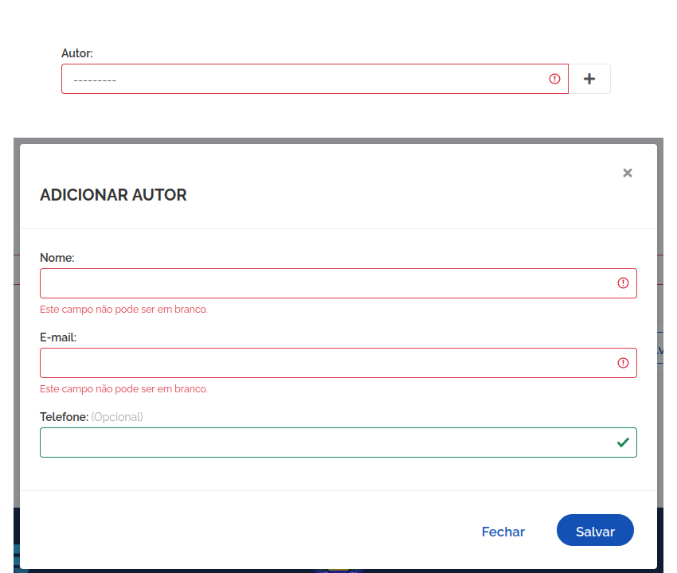

# Criar Modal para Modelos com campos ForeignKey

Caso você tenha um Model com campos ForeignKey e deseja que seja criado um modal para inserção de dados, leia mais sobre os passos para isso.

## Como funciona?

Quando o atributo `fk_fields_modal` é configurado, o build criará os HTMLs de criação e atualização com um botão ao lado do campo foreign key, caso o usuário tenha permissão de adição.

Os forms são enviados via context_data pelas views BaseCreateView e BaseUpdateView com base no atributo `form_modals` que deve ser configurado na view.

Ao clicar no botão, será aberto um modal com o formulário de criação do model relacionado.

O formulário possui mínima customização.

Ao pressionar em salvar o formulário, é acionada uma função JavaScript que envia o formulário para a URL da API do model relacionado e, em caso de sucesso, fecha o modal e atualiza o campo foreign key com o valor do ID do model criado. Em caso de erro, atribui cada erro ao campo correspondente.

Como forma de evitar duplicidade nos IDs dos campos do formulário, o modal é identificado no BaseForm pela palavra `Modal` no nome do formulário e assim é definido uma string aleatória que compõe cada um dos seus campos.


## Atenção
Construa os forms, views e urls do modelo relacionado antes de construir o modelo com fk_fields_modal, isso se deve ao fato do build fazer importações automáticas que podem ainda não terem sido criadas.


## Configuração do atributo fk_fields_modal no Models
```python   
# models.py
class Livro(Base):
        titulo = models.CharField(max_length=100)
        autor = models.ForeignKey(Autor, on_delete=models.CASCADE)

   class Meta:
        ...
        fk_fields_modal = ["autor"]
```

## Configuração especial no Forms
Adicione o nome "Modal" em seu formulário, recomenda-se criar um novo formulário para o modal, até mesmo herdando do formulário original.

```python
# forms.py
from core.forms import BaseForm
from .models import Livro

class LivroModalForm(BaseForm):
    class Meta:
        model = Livro
        fields = ['titulo', 'autor']
```

## Configurando o contexto da View
Adicione o formulário no contexto da view.
```python
# views.py
from core.views import BaseCreateView
from .forms import LivroModalForm

class LivroCreate(BaseCreateView):
   ...
   form_modals = [LivroModalForm]
```

## Configurando os templates
Se você estiver fazendo este processo manualmente ou adicionado um novo model `fk_fields_modal` após ter gerado os templates, a melhor maneira de se fazer é forçar o template a ser gerado novamente com o comando abaixo substituindo as palavras `app` e `Model` pelo nome do seu app e do seu model.

```bash
python manage.py build app Model --template --parserhtml --force --format=html
```

## Configurando API
Não é necessária nenhuma configuração extra, único requisito é que tenha feito a construção da API do model relacionado.


## Exemplo de Interface

