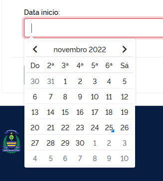

# Widget de Datas - Tempus Dominus

É possível usar esta biblioteca para renderizar
um datepicker, timepicker ou datetimepicker em seu formulário HTML.

## Forms

1. Em seu arquivo form, import o `widgets` do `tempus_dominus`

2. Importe também o `forms` do próprio `Django`

3. Adicione o campo que contenha `Datefield`, `Timefield` ou `Datetimefield`

4. Use o forms Django com widget do Tempus Dominus


```
from django import forms
from tempus_dominus import widgets as tempus_widgets
...
class SuaClasse():
    data_inicio = forms.DateField(
        widget=tempus_widgets.DatePicker(
            options={
                "format": "DD/MM/YYYY",
                "useCurrent": False,
                "locale": "pt-br",
            },
        )
    )

    hora_inicio = forms.TimeField(
        widget=tempus_widgets.TimePicker(
            options={
                "format": "HH:mm",
                "useCurrent": False,
                "locale": "pt-br",
            },
        )
    )

    data_hora_final = forms.DateTimeField(
        widget=tempus_widgets.DateTimePicker(
            options={
                "format": "DD/MM/YYYY HH:mm",
                "useCurrent": False,
                "locale": "pt-br",
            },
        )
    )
```

## HTML

É necessário a inclusão da tag `{{ form.media }}` dentro do HTML que contem o seu formulário.

Recomendo colocar no início do formulário, pois esta tag não pode ser duplicada ou o Widget não aparecerá.

```
<form>
   {{ form.media }}
   
   ...
</form>
```

## Exemplos


