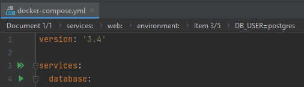
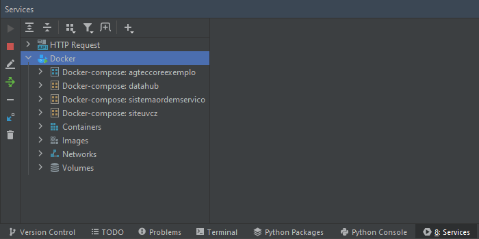
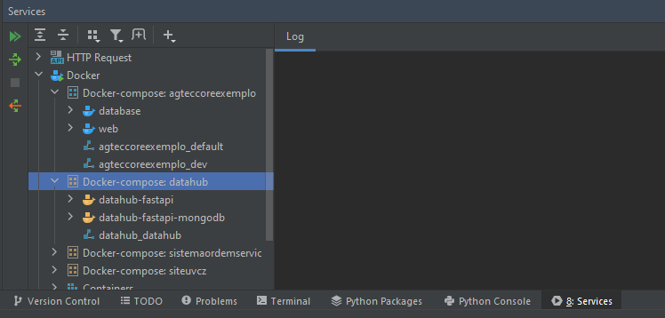
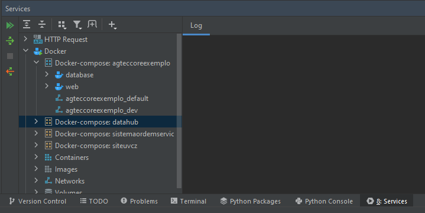
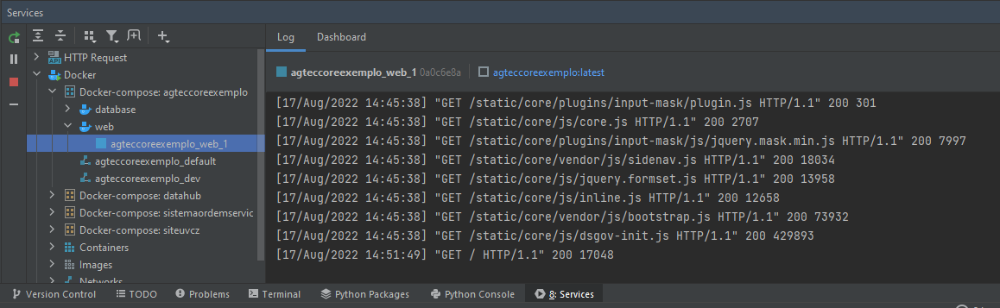
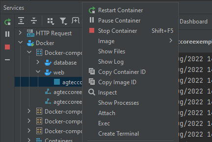
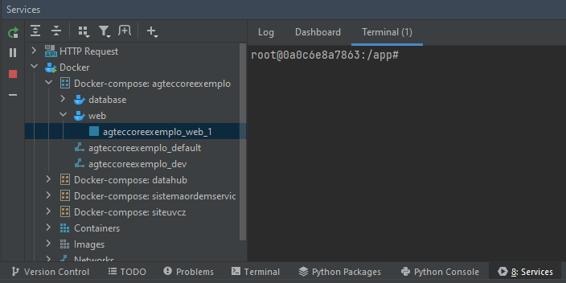
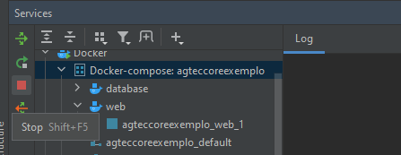

# Executando imagem Docker utilizando o Pycharm

** Para usuários Windows é necessário garantir que o WSL2 esteja configurado e tenha instalado o Docker Desktop **

Para executar um projeto utilizando docker no pycharm existem duas possibilidades

###  Abrindo o arquivo docker-compose.yaml

  
*Com o arquivo aberto basta clicar no ícone de "duplo play" na frente da palavra services.*    

### Executar pela janela de **Services**  
  1. Abrindo a janela deve aparecer uma imagem similar à apresentada abaixo  
  
        
      *No grupo Docker aparecerão todos os containers, imagens e volumes da sua máquina*  

  2.  Selecione a que deseja executar e novamente clique no ícone de "duplo play"  
        
      *Escolhendo o projeto que desejo executar*  

  3. Quando for finalizada a operação de construção do container os ícones do Docker ficarão azuis  
        
      *Projeto agteccoreexemplo sendo executado (ícones em azul)*  

  4. Quando for finalizada a operação de construção do container os ícones do Docker ficarão azuis  
        
      *Projeto agteccoreexemplo sendo executado (ícones em azul)* 

  5. Visualizando o log do container 
        
      *Para visualizar o log do container basta clicar sobre o container, conforme exemplo acima* 

  6. Acessar o container para executar comandos 
        
      *Para acessar o container e executar comandos no terminal basta clicar com o botão direito do mouse (Menu de context) e escolher a opção ****Create Terminal***  

      6.1. Terminal aberto já no container 
          
        ***Atenção: o terminal aberto já contem todas as bibliotecas do projeto instaladas, portanto não é necessário ativar virtualenv***  

  7. Finalizando a execução de um container
       
     *Para finalizar a execução dos containers do projeto basta selecionar o arquivo Docker-compose do projeto e clicar no ícone de stop*
