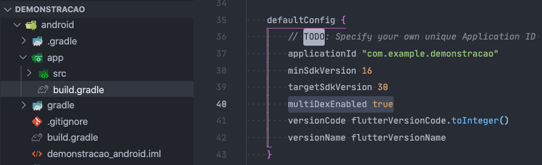

## Sobre 

No projeto existem dois managers para auxiliar o desenvolvimento do projeto Django, e se necessário auxiliar o desenvolvimento do projeto Mobile. 

* O primeiro manager **build** tem como objetivo gerar todo o código biolerplate padrão (CRUD) da aplicação Django.
* O segundo manager **flutter** tem como objetivo gerar um projeto [flutter](https://flutter.dev/ "target=_blank") baseado nas apps do projeto Django

### Manager Build
#### Parâmetros

1. App [Obrigatório] - Nome da app que deverá ser renderizada pelo manager 
2. Model [Opcional] - Nome do model que deverá ser renderizado pelo manager.
            (Caso não seja passada o sistema renderizará todos os models da App)  
3. templates [Opcional] - Caso seja passado apenas os arquivos de template HTML.  
    3.1. Para que o template de listagem renderize os campos corretamente, devem ser  
          setados quais atributos serão mostrados no parâmetro **fields_display** do class Meta do models  
     
    3.2. Para os models que possuem campos relacionais do tipo ForeignKey e você deseje que seja criado 
         o modal com um formulário para inserção de dados você deve configurar o atributo **fk_fields_modal** 
         também no class **Meta** do seu models.

            
            Exemplo:
            
            class Exemplo(Base):
                ...
                class Meta:
                    fields_display = ["atributo_um", "atributo_dois"', "atributo_n"]
                    fk_fields_modal = ["foreignkey_um", "foreignkey_dois", "foreignkey_n"]

4. url [Opcional] - Deve ser executado para criar as urls.
5. forms [Opcional] - Deve ser executado para criar os forms .
6. views [Opcional] - Deve ser executado para criar as ClassBaseView`s.
7. renderhtml [Opcional] - Deve ser executado para renderizar os formulários no templates HTML.
8. format [Opcional] - Dever ser executado para formatar o código utilizando a PEP 8.
9. api [Opcional] - Deve ser executado para gerar todo o código (CRUD) boilerplate da APIRest.

#### Executar
    python manage.py build NomeDaApp

-----

### Manager Flutter

### Observação
> Para que o projeto funcione corretamente é necessário ter na sua máquina o Dart 2.12.3 e o Flutter 2.0.5 na versão 
> mínima.  
> 
> Para baixar as ferramentas acesse https://flutter.dev/

> Para que esse manager funcione de forma correta devem ser configurados no arquivos settings.py do projeto os seguintes valores:  
>   1. **FLUTTER_APPS = ['usuario', ]**  
>   2. **API_PATH** = https://dominio.com.br/core/api

#### Executar
    python manage.py flutter

### Configuração Projeto Android
>    Para que o projeto Android funcione de forma correta é necessário adicionar o parâmetro:  
>  **multiDexEnabled true**
> Vide exemplo abaixo

Os comandos abaixo devem ser utilizado caso seja criada uma nova app no projeto Django e você queirar gerar o correspondente no projeto Flutter

Para gerar os arquivos flutter de uma determinada App/Model
> python manage.py flutter --model NomeDaApp nome_do_model

Para atualizar o arquivo main.dart com todas as apps do projeto
> python manage.py flutter --main

Como resultado desse comando será criado um diretório de nome flutter no mesmo nível do diretório raiz do projeto e dentro desse diretório estará o projeto flutter.