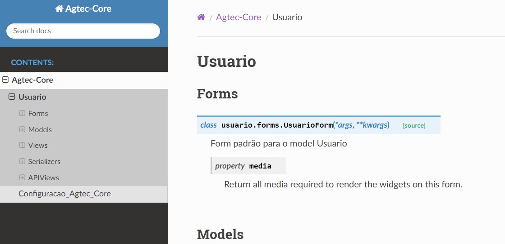

# Documentação Sphinx

Sphinx é um gerador de documentação  que traduz um conjunto de arquivos
fonte de texto simples em vários formatos de saída, produzindo automaticamente referências
cruzadas e índices. 

## Executar
 
Para gerar a documentação das apps é necessário primeiramente adicioná-las no ```DOC_APPS``` 
localizado no ```settings.py```, esta é a lista das apps que devem ser mapeadas pelo sphinx 
como no exemplo a seguir:

 ```DOC_APPS = ["usuario", "configuracao_core"]```

Após a inclusão das apps no DOC_APPS execute o comando a seguir:

```python
python manage.py doc <nome_projeto> <nome_desenvolvedor>
```

Ao executar o comando anterior o seguinte processo acontecerá é uma pasta com nome ```doc``` 
será criada na raiz do projeto com toda a documentação dentro.

```
Running Sphinx v6.2.1
making output directory... done
[autosummary] generating autosummary for: configuracao_core.rst, index.rst, modules.rst, usuario.rst
building [mo]: targets for 0 po files that are out of date
writing output... 
building [html]: targets for 4 source files that are out of date
updating environment: [new config] 4 added, 0 changed, 0 removed
reading sources... [100%] usuario
looking for now-outdated files... none found
pickling environment... done
preparing documents... done
writing output... [100%] usuario
generating indices... genindex py-modindex done
highlighting module code... [100%] usuario.views
writing additional pages... search done
copying static files... done
copying extra files... done
build succeeded.
```
## Ler a Documentação 

Para visualizar a documentação basta executar o arquivo ```index.html``` localizado dentro de doc/source/html/index.html




